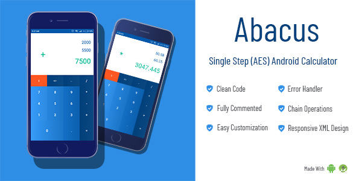

<h2>Abacus</h2>
<strong>A State Based Simple Arithmatic Calculator with Android Studio</strong>
   
<!--  -->
<h3>Description</h3>

<b>Abacus</b> is a general purpose <b>Android Calculator App</b> that works on single step, algebraic entry system mode.
 
Optimized to perform arithmetic calculations without causing floating point or user input error.

<ul>
<li>Written in pure <b>Java</b> and <b>XML</b></li>
<li>Easily <b>Customizable</b> and <b>Responsive</b> Layout Design</li>
<li><b>Chain Operations</b> implemented</li>
<li>Clean and Explained Code Structure</li>
</ul>

 
  

<b>Platform:</b> Android

<b>Files Included:</b> .java files, .xml files (Full Android Studio Project)

<b>Demo:</b> You can download the demo app from res Folder

